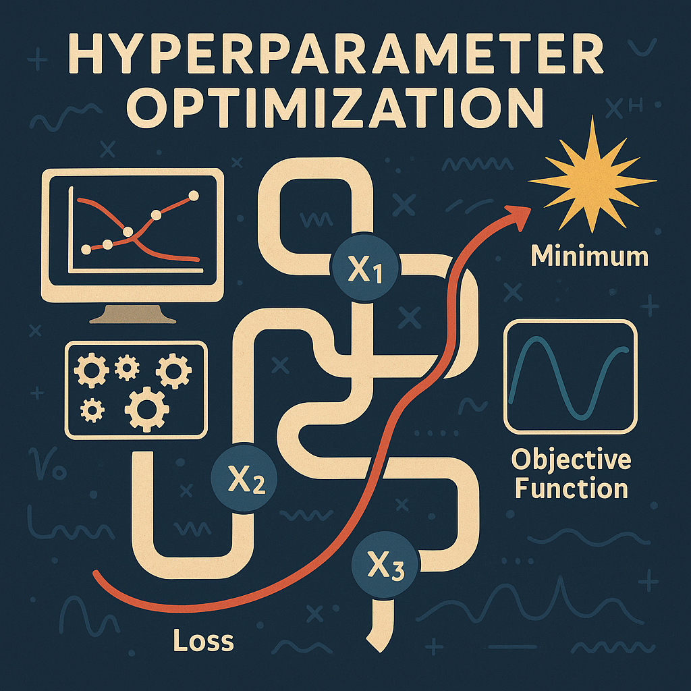

[**English**](README.md) | [한국어](README_KR.md)

# Hyperparameter Optimization Learning Lab

[](https://github.com/hyeonsangjeon/Hyperparameters-Optimization/actions/workflows/ci.yml)
[](https://www.python.org/)
[](LICENSE)
[](HyperParameterInspect_EN.ipynb)

<div align="center">
  
</div>

A reproducible, bilingual tutorial for learning **how to design and evaluate HPO
experiments**, not just how to call optimizer libraries.

The tutorial remains one continuous notebook per language:

- [English notebook](HyperParameterInspect_EN.ipynb)
- [한국어 노트북](HyperParameterInspect.ipynb)

Both notebooks contain byte-identical code cells and differ only in explanatory text.
Their committed `quick`-mode outputs let GitHub render all result tables and charts
without requiring visitors to run the cells first.

## What makes this tutorial different

- Separates **search algorithms**, **resource allocation**, **frameworks**, and
  **evaluation design**.
- Compares Grid, Random, TPE, Gaussian Process, and CMA-ES under matched trial,
  fold, split, and search-bound budgets.
- Reports CV selection loss, unseen holdout performance, model-fit counts,
  wall-clock cost, multiple seeds, and 95% confidence intervals.
- Implements real Hyperband pruning with intermediate reporting and incremental
  LightGBM training.
- Includes conditional spaces, nested CV, multi-objective Pareto optimization,
  classification support, SQLite resume, CLI export, and CI notebook execution.
- Avoids hard-coded claims that one optimizer is universally best.

<!-- benchmark-snapshot:start -->

## ⚡ Reproducible benchmark snapshot

**Diabetes regression · 442 samples · 10 features · LightGBM · 12 trials/method · 3-fold CV · seeds 17, 42**

| Method | Holdout MSE ↓ | Observed range | Improvement vs baseline ↑ | Search time ↓ | Fits | Good fit |
|---|---:|---:|---:|---:|---:|---|
| **Grid** | 3011.5 | 2797.2–3225.7 | +17.2% | 0.98s | 37 | Small discrete spaces; transparent baseline |
| **TPE** | 3149.9 | 2884.8–3415.0 | +13.5% | 1.77s | 37 | Mixed and conditional spaces |
| **GP** | 3185.4 | 2858.7–3512.2 | +12.7% | 1.43s | 37 | Low-dimensional, expensive objectives |
| **CMA-ES** | 3273.4 | 2892.7–3654.1 | +10.5% | 1.24s | 37 | Continuous parameters with interactions |
| **Random** | 3294.2 | 2875.3–3713.1 | +10.0% | 1.35s | 37 | Space scouting and a strong baseline |
| **Baseline** | 3661.0 | 3203.1–4119.0 | — | 0.06s | 4 | Untuned reference |

> **Interpretation:** This is a reproducible equal-budget snapshot, not a universal leaderboard. With only two seeds, read the mean together with the observed range. Search time varies by hardware and parallel settings.

Source: [`runs.csv`](benchmarks/quick/runs.csv) · [config](benchmarks/quick/config.json) · [environment](benchmarks/quick/environment.json) (Python 3.14.2)<br>
Source commit: [`8143cd2`](https://github.com/hyeonsangjeon/Hyperparameters-Optimization/commit/8143cd2ce9a01d3eda26ed4778741f94065af29c) · Reproduce: `uv run hpo-lab benchmark --mode quick`

<!-- benchmark-snapshot:end -->

## Quick start

### With uv

```bash
git clone https://github.com/hyeonsangjeon/Hyperparameters-Optimization.git
cd Hyperparameters-Optimization
uv sync --extra notebook
uv run jupyter lab HyperParameterInspect_EN.ipynb
```

### With pip

```bash
python -m venv .venv
source .venv/bin/activate
python -m pip install -r requirements.txt
jupyter lab HyperParameterInspect_EN.ipynb
```

The notebook defaults to `quick` mode. Select another mode before launching:

```bash
HPO_MODE=smoke uv run jupyter lab  # fastest installation check
HPO_MODE=full uv run jupyter lab   # deeper experiment
```

| Mode | Intended use | Core behavior |
|---|---|---|
| `smoke` | CI and environment check | Minimal trials and one seed |
| `quick` | Interactive tutorial | All core optimizers and two seeds |
| `full` | Deeper analysis | More trials, folds, seeds, and classification |

## Learning path

| Section | Topics |
|---|---|
| Experiment contract | Equal budgets, shared folds, holdout isolation |
| Black-box search | Grid, Random, TPE, GP + Expected Improvement, CMA-ES |
| Search-space design | Log scales, integer domains, constraints, conditional branches |
| Multi-fidelity | Successive Halving concepts, Hyperband, actual pruning |
| Reliable evaluation | Multiple seeds, confidence intervals, nested CV |
| Multi-objective HPO | Accuracy/complexity Pareto frontier and knee selection |
| Operations | SQLite resume, CSV/JSON export, CLI, reproducible environments |
| Transfer challenge | Regression and optional classification benchmark |

## Reproducible CLI benchmark

```bash
uv run hpo-lab benchmark --mode smoke
uv run hpo-lab benchmark --mode quick --method Random --method TPE
uv run hpo-lab benchmark --mode full --dataset breast_cancer
```

The compatibility command still works:

```bash
uv run python benchmark_hpo_algorithms.py --mode quick
```

Runs write to `artifacts/`:

```text
best_params.json
config.json
convergence.png
history.csv
quality-vs-time.png
runs.csv
seed-stability.png
summary.csv
```

## Experimental design

The default benchmark uses sklearn Diabetes regression and LightGBM. Every
optimizer receives:

1. The same train/holdout split for a seed.
2. The same deterministic CV folds.
3. The same outer parameter bounds.
4. The same candidate count and fold count.
5. Holdout access only after CV has selected the best configuration.

Grid uses a finite set of points while other optimizers sample continuous
domains, so candidate count alone cannot prove fairness. The tutorial therefore
also exposes model-fit count, resource units, optimizer overhead, elapsed time,
seed sensitivity, and nested-CV estimates.

## Project structure

```text
.
├── HyperParameterInspect.ipynb       # Korean comprehensive tutorial
├── HyperParameterInspect_EN.ipynb    # English translation, identical code
├── src/hpo_lab/                      # Tested experiment engine and plots
├── benchmarks/quick/                 # Tracked README benchmark provenance
├── tools/build_notebooks.py          # Deterministic bilingual notebook builder
├── tools/execute_notebooks.py        # Publish synchronized outputs and charts
├── tools/render_benchmark_snapshot.py # Generated benchmark tables
├── tests/                            # Unit and synchronization tests
├── benchmark_hpo_algorithms.py       # Backward-compatible CLI entry point
├── pyproject.toml                    # Package and dependency metadata
├── uv.lock                           # Reproducible dependency lock
├── README.md
├── README_KR.md
└── pic/                              # Tutorial illustrations
```

Regenerate, execute, and verify the notebooks:

```bash
uv run python tools/build_notebooks.py
uv run python tools/execute_notebooks.py
uv run python tools/build_notebooks.py --check
uv run python tools/execute_notebooks.py --check
```

`execute_notebooks.py` executes the Korean source once in `quick` mode and copies
the byte-identical code outputs into the English notebook. A runtime fingerprint
covering notebook code, `src/hpo_lab/`, `pyproject.toml`, and `uv.lock` makes stale
or stripped outputs fail tests and CI. Source-only regeneration preserves published
outputs whenever the code cells are unchanged.

## Historical context

This repository grew from HPO conference material and has now been rebuilt as
an executable learning lab.

- Hyeonsang Jeon, “Expert Lecture: Hyperparameter Optimization in AI
  Modeling,” *ITDAILY*, 2022 — [article](http://www.itdaily.kr/news/articleView.html?idxno=210339)
- Hyeonsang Jeon, “AutoDL with Hyperparameter Optimization in Deep Learning
  Platforms,” *AI Innovation 2020* — [video](https://youtu.be/QMorERxb1YY)
- Original presentation PDFs remain in the repository root.

## License

MIT License. See [LICENSE](LICENSE).

**Author:** [Hyeonsang Jeon](https://github.com/hyeonsangjeon)
