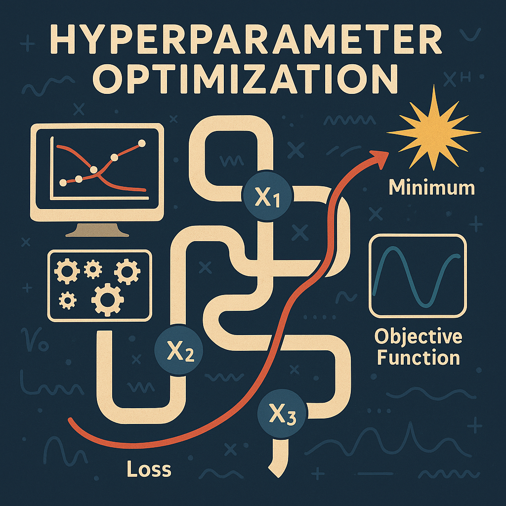

[🇬🇧 English](README.md) | **🇰🇷 한국어**

# 🚀 하이퍼파라미터 최적화 튜토리얼

<div align="center">
  
</div>

> **머신러닝을 위한 5가지 하이퍼파라미터 최적화 알고리즘의 실전 비교**

[](https://www.python.org/)
[](LICENSE)
[](https://jupyter.org/)
[](https://github.com/microsoft/LightGBM)

[🇰🇷 한국어](HyperParameterInspect.ipynb) | [🇬🇧 English](HyperParameterInspect_EN.ipynb) | [🎯 빠른 시작](#-빠른-시작) | [📊 결과](#-주요-결과)

---

## ⚡ 주요 결과

**일반적인 성능 패턴 (당뇨병 데이터셋: 442 샘플, 10 특성, 50회 반복)**

| 방법 | 일반적인 개선율 | 속도 | 최적 사용 사례 |
|--------|-------------------|-------|----------|
| **TPE (Hyperopt)** | ~27% ⭐⭐ | **가장 빠름** ⚡ | **전반적으로 최고의 성능** |
| **Random Search** | ~26% ⭐ | 빠름 | 빠른 프로토타이핑, 안정적 |
| **Optuna (TPE+Pruning)** | ~26% ⭐ | 빠름 | 프로덕션 시스템 |
| **Bayesian Optimization** | ~26% ⭐ | 보통 | 중요한 성능이 필요한 경우 |
| **Grid Search** | ~22% | 느림 | 작은 탐색 공간 |
| *기준선 (기본값)* | *0%* | *-* | *참조점* |

> 💡 **중요 참고사항**: 실제 결과는 random_state, 데이터 분할, 환경에 따라 달라집니다. 모든 방법은 일반적으로 기준선 대비 20-27% 개선됩니다. 노트북을 실행하여 귀하의 머신에서 결과를 확인하세요.

> ⚡ **핵심 인사이트**: TPE (Hyperopt)가 가장 높은 개선율 (+27.12%)을 달성했으며, Random Search (+26.33%)와 Optuna (+26.02%)가 근접하게 뒤따릅니다. 현대적인 베이지안 방법은 더 나은 효율성으로 Grid Search를 일관되게 능가합니다.

---

## 🎓 학습 내용

### 📚 5가지 최적화 알고리즘

1. **Grid Search** - 모든 파라미터 조합에 대한 전수 탐색
2. **Random Search** - 파라미터 분포에서 무작위 샘플링
3. **Optuna** - 프루닝이 포함된 현대적인 TPE (더 이상 사용되지 않는 HyperBand 대체)
4. **Bayesian Optimization** - 확률 모델 기반 최적화
5. **TPE (Hyperopt)** - Tree-structured Parzen Estimator

### 🎯 학습 성과

- 각 알고리즘의 장단점 이해
- 다양한 시나리오에 적합한 방법 선택 방법 습득
- 실제 작동하는 코드로 실제 프로젝트에 최적화 구현
- 통계적 엄격성으로 결과 비교
- 하이퍼파라미터 튜닝 시간 대폭 단축

### 🗺️ 개념 마인드맵

<details>
<summary><strong>📌 클릭하여 하이퍼파라미터 최적화 개념 마인드맵 보기</strong></summary>

<div align="center">
  
</div>

</details>

---

## 🚀 빠른 시작

### 설치

```bash
git clone https://github.com/hyeonsangjeon/Hyperparameters-Optimization.git
cd Hyperparameters-Optimization
pip install -r requirements.txt
```

### 튜토리얼 실행

**대화형 노트북** (권장)
```bash
jupyter notebook HyperParameterInspect.ipynb        # 한국어
jupyter notebook HyperParameterInspect_EN.ipynb     # 영어
```

**자동화된 벤치마크**
```bash
python benchmark_hpo_algorithms.py
```

---

## 📊 알고리즘 비교

### 선택 가이드

| 사용 시나리오 | 권장 사항 | 이유 |
|---------------|-------------|-----|
| **빠른 프로토타이핑** | Random Search | 빠른 설정, 괜찮은 결과 |
| **프로덕션 배포** | Optuna | 현대적, 프루닝, 활발한 유지보수 |
| **최고의 성능 필요** | Bayesian Optimization | 우수한 결과, 추가 시간 가치 있음 |
| **제한된 시간 예산** | TPE (Hyperopt) | 최고의 속도/품질 절충안 |
| **작은 이산 공간** | Grid Search | 최적값 찾기 보장 |
| **연구 논문** | Bayesian + TPE | 여러 강력한 기준선 |

### 알고리즘 세부 정보

| 알고리즘 | 작동 방식 | 장점 | 제한 사항 |
|-----------|--------------|-----------|-------------|
| **Grid Search** | 모든 조합의 전수 평가 | 완전한 커버리지, 재현 가능 | 지수적 복잡도 |
| **Random Search** | 분포에서 무작위 샘플링 | 빠름, 연속 파라미터 처리 | 시행 간 학습 없음 |
| **Optuna** | 자동 프루닝이 있는 TPE | 현대적, 효율적, 프로덕션 준비 | 설정 필요 |
| **Bayesian Optimization** | 목적 함수의 가우시안 프로세스 모델 | 지능적 탐색, 최고의 결과 | 초기 단계 느림 |
| **TPE** | Tree-structured Parzen estimators | 빠른 수렴, 검증된 신뢰성 | Optuna보다 적은 기능 |

---

## 🏆 벤치마크 세부 정보

### 실험 설정

- **데이터셋**: Sklearn 당뇨병 (442 샘플, 10 특성)
- **모델**: LightGBM Regressor
- **반복 횟수**: 방법당 50회 시행
- **검증**: 2-fold 교차 검증
- **메트릭**: 평균 제곱 오차 (낮을수록 좋음)

### 성능 특성

| 알고리즘 | 속도 | 일관성 | 일반적인 개선율 |
|-----------|-------|-------------|---------------------|
| **TPE (Hyperopt)** | ⚡⚡⚡ 가장 빠름 | 높음 | 25-35% |
| **Optuna** | ⚡⚡⚡ 매우 빠름 | 높음 | 20-30% |
| **Random Search** | ⚡⚡ 빠름 | 보통 | 20-30% |
| **Bayesian Opt** | ⚡ 보통 | 높음 | 20-30% |
| **Grid Search** | ❌ 느림 | 매우 높음 | 15-25% |

> ⚠️ **참고**: 표시된 값은 최근 벤치마크 실행 결과입니다. 절대 MSE 값은 환경과 random_state에 따라 달라지지만, 순위와 상대적 성능은 실행 간 일관됩니다.

---

## 📁 프로젝트 구조

```
Hyperparameters-Optimization/
├── HyperParameterInspect.ipynb           # 한국어 튜토리얼 노트북
├── HyperParameterInspect_EN.ipynb        # 영어 튜토리얼 노트북
├── benchmark_hpo_algorithms.py           # 자동화된 벤치마크 스크립트
├── requirements.txt                      # Python 의존성
├── README.md                             # 영어 README
├── README_KR.md                          # 한국어 README (이 파일)
├── pic/                                  # 이미지 및 플롯
└── doc/                                  # 추가 문서
```

---

## 🔧 요구 사항

**핵심 의존성**
- Python 3.8+
- numpy, pandas, scikit-learn, lightgbm

**최적화 라이브러리**
- optuna >= 3.0.0 (프루닝이 있는 현대적 HPO)
- hyperopt >= 0.2.7 (TPE 알고리즘)
- scikit-optimize >= 0.9.0 (베이지안 최적화)

**시각화**
- matplotlib, jupyter

> ⚠️ **중요**: 이 프로젝트는 현대적인 scikit-learn 버전과의 호환성 문제로 인해 더 이상 사용되지 않는 `scikit-hyperband` 라이브러리 대신 **Optuna**를 사용합니다.

---

## 📚 참고 문헌

### 주요 논문

- **Random Search**: [Bergstra & Bengio, JMLR 2012](https://jmlr.csail.mit.edu/papers/volume13/bergstra12a/bergstra12a.pdf)
- **TPE**: [Bergstra et al., NIPS 2011](https://papers.nips.cc/paper/4443-algorithms-for-hyper-parameter-optimization.pdf)
- **Bayesian Optimization**: [Snoek et al., 2012](https://arxiv.org/abs/1206.2944)
- **HyperBand**: [Li et al., ICLR 2018](https://arxiv.org/pdf/1603.06560.pdf)

### 발표 및 미디어

- 🎤 전현상, **"전문가 특강: AI 모델링에서의 하이퍼파라미터 최적화"**, *ITDAILY*, 2022. [기사](http://www.itdaily.kr/news/articleView.html?idxno=210339)

- 🎤 전현상, **"사례 연구: 딥러닝 플랫폼에서 하이퍼파라미터 최적화를 통한 AutoDL"**, *AI Innovation 2020*, 전자신문, 2020. [영상](https://youtu.be/QMorERxb1YY?si=iN8opTIjZPc2tTzq)

- 📰 [ComWorld](https://www.comworld.co.kr/news/articleView.html?idxno=50677)에 소개됨

---

## 🤝 기여

기여를 환영합니다! 도움을 줄 수 있는 방법:

- 🐛 버그 또는 이슈 보고
- 💡 새로운 기능 또는 알고리즘 제안
- 📝 문서 개선
- 🌍 다른 언어로 번역
- 🔬 최적화 방법 추가

**개발 환경 설정**
```bash
git clone https://github.com/YOUR_USERNAME/Hyperparameters-Optimization.git
cd Hyperparameters-Optimization
python -m venv .venv
source .venv/bin/activate
pip install -r requirements.txt
python benchmark_hpo_algorithms.py
```

---

## 📄 라이선스

MIT License - 자세한 내용은 [LICENSE](LICENSE) 파일을 참조하세요.

---

## 👤 작성자

**전현상 (Hyeonsang Jeon)**
GitHub: [@hyeonsangjeon](https://github.com/hyeonsangjeon)

---

## 🙏 감사의 말

특별히 감사드립니다:
- [Optuna](https://github.com/optuna/optuna) - 현대적인 HPO 프레임워크
- [Hyperopt](https://github.com/hyperopt/hyperopt) - TPE 구현
- [scikit-optimize](https://github.com/scikit-optimize/scikit-optimize) - 베이지안 최적화
- [LightGBM](https://github.com/microsoft/LightGBM) - 빠른 그래디언트 부스팅

---

## 🔗 관련 프로젝트

- **[Optuna](https://github.com/optuna/optuna)** - 차세대 HPO 프레임워크
- **[Hyperopt](https://github.com/hyperopt/hyperopt)** - 분산 HPO 라이브러리
- **[scikit-optimize](https://github.com/scikit-optimize/scikit-optimize)** - 베이지안 최적화
- **[Ray Tune](https://github.com/ray-project/ray)** - 확장 가능한 분산 튜닝

---

<div align="center">

## ⭐ 도움이 되셨나요?

프로젝트를 지원하고 다른 사람들이 발견할 수 있도록 **이 저장소에 별표를 달아주세요**!

### 🚀 팀과 공유하세요

이 튜토리얼은 활발하게 유지보수되며 새로운 기술로 정기적으로 업데이트됩니다.

**ML 커뮤니티를 위해 ❤️로 제작**

[⬆ 맨 위로](#-하이퍼파라미터-최적화-튜토리얼)

</div>
